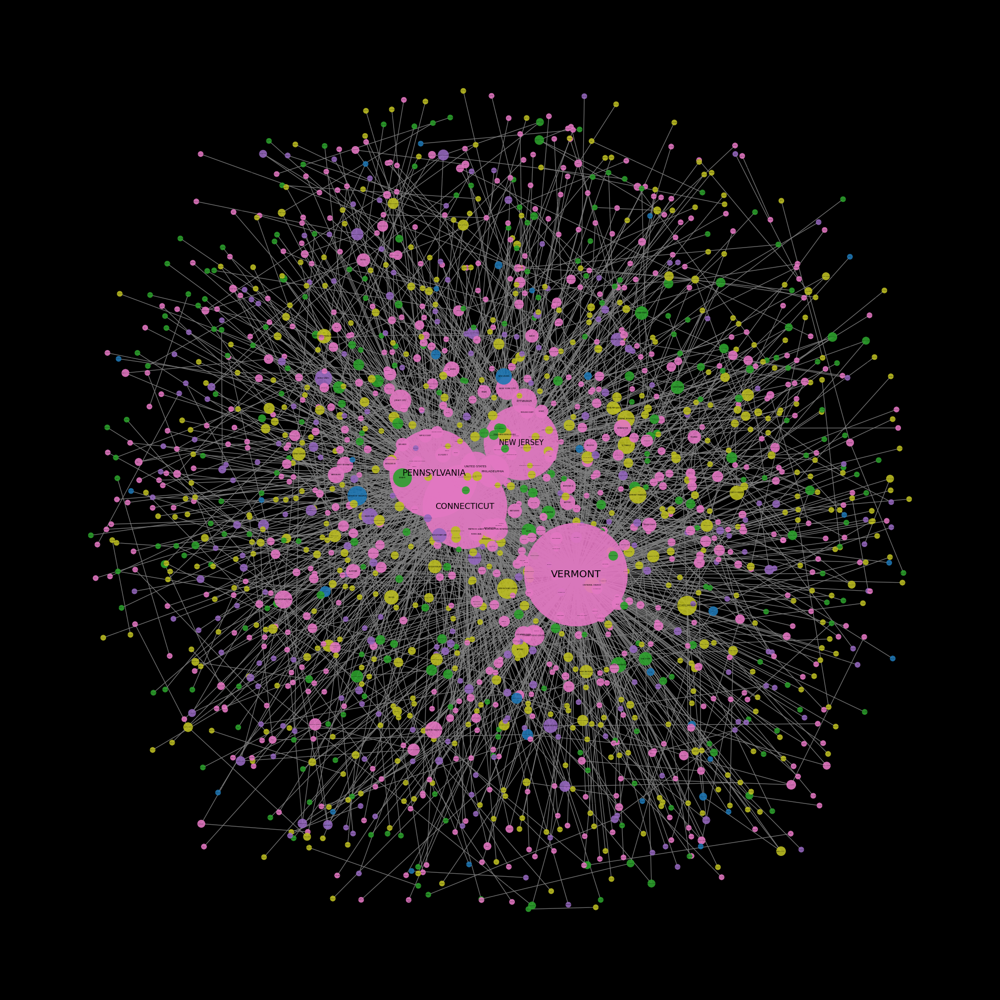

# GraphRag
Simple retrieval tasks have become easier with the widespread adoption of RAG techniques, the focus is shifting towards advanced systems that can provide comprehensive answers to global queries and reason over large text collections. Microsoft’s GraphRAG emerges as an advanced solution to address this growing need by utilizing knowledge graphs. 
This approach involves building a structured knowledge graph from a collection of documents, pinpointing key entities like people, places, and concepts, and representing them as nodes in a graph.
These nodes are then organized into semantic clusters, facilitating the production of more detailed and varied responses to complex, multi-hop queries. By making use of these structured knowledge graphs, GraphRAG enhances the quality and relevance of the generated answers.

In this notebook we will be implementing a Microsoft Graphrag ingestion pipeline to create a graph from the raw text data and will run few queries on the craeted graph 

# Prerequisites
## 1. Conda Environment
Please create a Python 3.10-3.12 Conda environment with below commands. 

    conda create -n graph python=3.11 -y && conda activate graph

    pip install graphrag

    conda activate graph

We will use the "graph" Conda environment to run the GraphRAG.ipynb notebook and create the graph indexes.
## 2. Input Data
The text file need to be placed inside an **input** folder so that the Graph init command can read the text files

    - The file location for this notebook is a local drive

You can also use the Microsoft Fabric OneLake location by following below steps 

    - Download and Install the Onelake file explorer from https://www.microsoft.com/en-us/download/details.aspx?id=105222 

    - Once installed you will be able to browse to your Fabric workspace and oneLake

    - Copy the text file which you want to be gaphed inside the Files folder in oneLake
# Graph
The below Graph will be generated based on the example data in input folder

